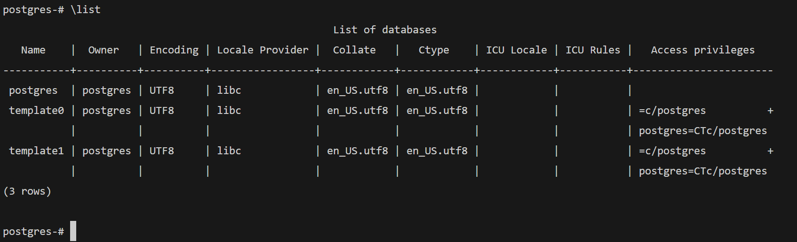
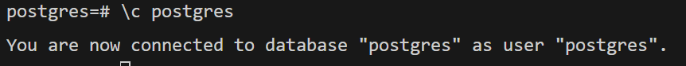
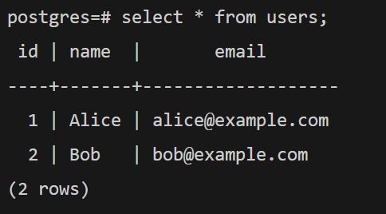

# Database

```sh
# 도커 컴포즈를 실행하여 postgresql 을 실행한다.
docker compose up -d


# container shell 접속
docker exec -it postgres1234 sh

# postgresql 접속
psql -U postgres

```

```psql
\list
```



```psql
\c postgres
```



```psql
select * from users;
```


