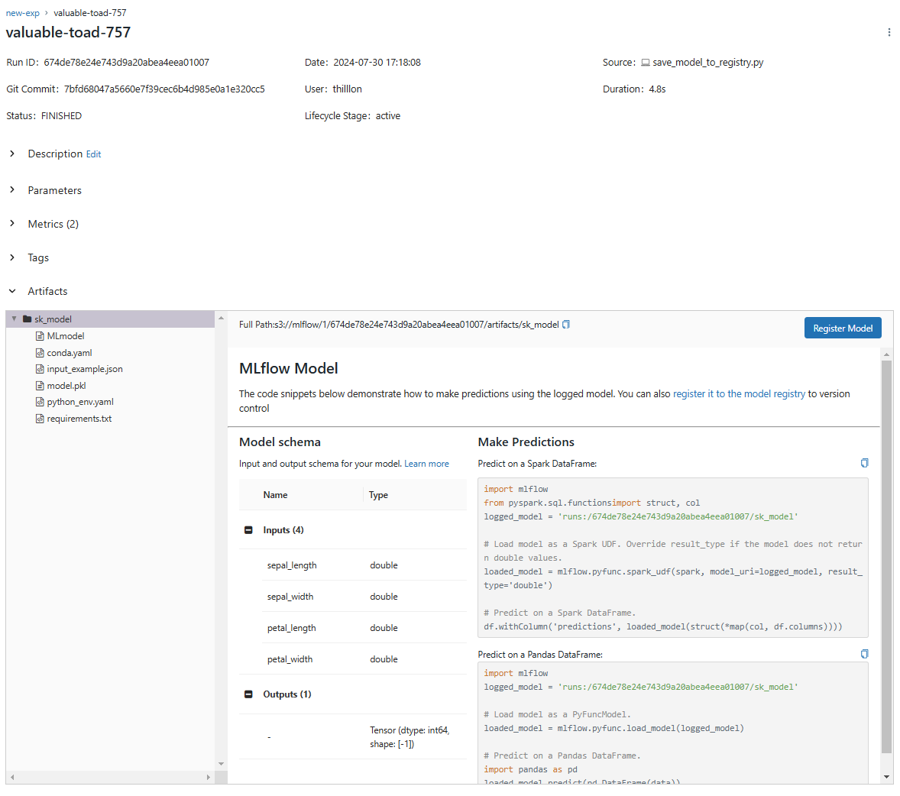

# ML flow

```sh
docker compose up --detach --build
docker ps -a # Container ID 확인
# 위치 경로 예시
# docker cp [netflix.csv host 파일위치] [컨테이너 ID]:옮길 위치
docker cp ./netflix_titles_nov_2019.csv e97600b74ad2:/

docker exec -it e97600b74ad2 sh
mv /netflix_titles_nov_2019.csv /var/lib/mysql-files/netflix_titles_nov_2019.csv

# 잘 옮겨졌는지 확인
cd /var/lib/mysql-files/
ls
```

```sql
-- mysql 접속 후
-- secure file privilege
select @@GLOBAL.secure_file_priv;
-- 이 결과가 예측됨. /var/lib/mysql-files/
-- 이 변수는 보안을 위해 사용되며, 파일 읽기 및 쓰기 작업을 제한하여 잠재적인 보안 위협을 줄이기 위해 사용됩니다.


create database netflix;

use netflix;

-- 테이블 생성

create table netflix_titles (
    show_id VARCHAR(255),
    title VARCHAR(255),
    director TEXT,
    cast TEXT,
    country TEXT,
    date_added DATE,
    release_year INT,
    rating VARCHAR(50),
    duration VARCHAR(100),
    listed_in TEXT,
    description TEXT,
    type VARCHAR(100)
);


-- 데이터 로드

LOAD DATA INFILE '/var/lib/mysql-files/netflix_titles_nov_2019.csv'
INTO TABLE netflix_titles
FIELDS TERMINATED BY ','
OPTIONALLY ENCLOSED BY '"'
LINES TERMINATED BY '\n'
IGNORE 1 LINES
(show_id, title, director, cast, country, @date_added, release_year, rating, duration, listed_in, description, type)
SET date_added = IF(@date_added='', NULL, STR_TO_DATE(@date_added, '%M %d, %Y'))
;
```

## quiz

### 1. 2019년 개봉한 영화 제목을 csv형태로 추출

```sql
SELECT title
FROM netflix_titles
WHERE release_year = 2019

INTO OUTFILE '/var/lib/mysql-files/new.csv'
FIELDS TERMINATED BY ','
ENCLOSED BY '"'
LINES TERMINATED BY '\n'
;
```

### 2. type별로 각 type의 갯수를 반환하세요. 컬럼명 cnt로 출력

```sql
SELECT type, count(type) as cnt
FROM netflix_titles
GROUP BY type
;
```

### 3. `Luis Ara, Ignacio Jaunsolo`감독이 감독한 영화 제목 찾기

```sql
select title
from netflix_titles
where director = 'Luis Ara, Ignacio Jaunsolo'
;
```

### 4. 2019년 11월에 넷플릭스에 어떤 타이틀이 추가되었는가? csv형태로 추출하기

```sql
SELECT title
FROM netflix_titles
WHERE date_added between '2019-11-01' and '2019-11-30'

INTO OUTFILE '/var/lib/mysql-files/quiz4.csv'
FIELDS TERMINATED BY ','
ENCLOSED BY '"'
LINES TERMINATED BY '\n'
;
```

### 5. 특정 키워드(`winter`)를 포함한 제목 검색

```sql
;
select title
from netflix_titles
where title like '%winter%'
;
```


